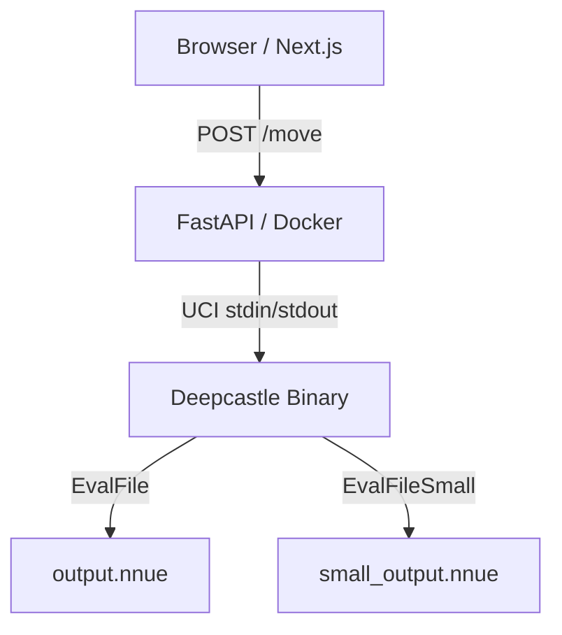

# 👑 DeepCastle v7 (Official)

[](https://fastapi.tiangolo.com/)
[](https://nextjs.org/)
[](https://pytorch.org/)
[](https://isocpp.org/)
[](https://www.docker.com/)

**Deepcastle v7** is a professional-grade, full-stack chess engine ecosystem. It combines a **custom-trained NNUE** (Efficiently Updatable Neural Network) with a powerful **Stockfish-derived search core** and a modern web interface.

> [!TIP]
> **Play Live:** [deep-castle-official.vercel.app](https://deep-castle-official.vercel.app/)

 ---

## 🚀 Key Features

### 🧠 The Evaluation Core (NNUE)
*   **Architecture:** Custom **HalfKAv2** neural network (DeepCastle7 class) with ~500K parameters.
*   **Multi-Phase Eval:** 8 specialized internal networks (buckets) that automatically switch based on piece count (Opening → Middle → Endgame).
*   **Product Pooling (SqrCReLU):** Captures high-order multiplicative interactions between White and Black perspectives.
*   **Quantization:** Fully quantized to `int16`/`int8` for lightning-fast SIMD inference.

### 🔍 Search Core
*   **Algorithm:** Alpha-Beta Minimax with Principal Variation Search (PVS).
*   **Tactical Depth:** Iterative Deepening, Aspiration Windows, and Late Move Reductions (LMR).
*   **Pruning:** Null Move Pruning, Futility Pruning, and aggressive Quiescence search.
*   **Speed:** Optimized for ~400k–600k nodes/s (NPS) on cloud-grade CPUs.

### 🌐 Web & API
*   **Frontend:** Stunning Next.js 16 interface with real-time evaluation bar, move analysis, and game history.
*   **Backend:** High-performance FastAPI UCI bridge with automated memory management and dead-socket cleanup.
*   **Real-time:** WebSockets for multiplayer and live engine updates.

---

## 🏗️ System Architecture



*   **`web/`**: Next.js App (React 19, Tailwind CSS 4, Framer Motion).
*   **`server/`**: FastAPI implementation using `python-chess`.
*   **`engine/`**: C++ Source (Stockfish-derived) and build scripts.
*   **`training/`**: PyTorch Lightning training pipeline with Ranger21 optimizer.

---

## 🛠️ Performance & Memory Management

Deepcastle v7 is engineered for stability on resource-limited hosts like Hugging Face Spaces:
- **Background RAM Cleanup:** Automatically clears engine hash tables if memory exceeds 400MB.
- **Singleton Engine:** Shared UCI process with locking to prevent concurrent search corruption.
- **Request Serialization:** Ensures the engine stays synchronized under heavy traffic.

---

## 📚 References & Credits

This project stands on the shoulders of giants. Below are the primary sources, repositories, and research that made Deepcastle possible:

### 🔬 Core Engine & Search
- **[Official Stockfish](https://github.com/official-stockfish/Stockfish):** The legendary GPLv3 search core that powers Deepcastle's thinking.
- **[Stockfish Documentation](https://stockfishchess.org/blog/):** Invaluable deep-dives into NNUE and search heuristics.

### 🧠 NNUE & Machine Learning
- **[official-stockfish/nnue-pytorch](https://github.com/official-stockfish/nnue-pytorch):** The foundation for the training stack and architectural designs.
- **[Stockfish Training Datasets](https://github.com/official-stockfish/nnue-pytorch/wiki/Training-datasets):** Used high-quality depth-9 quiet position datasets for training `v7`.
- **[Ranger21 Optimizer](https://github.com/lessw2020/Ranger21):** The advanced optimizer used for stable and fast convergence during NNue training.

### 📡 Web & Infrastructure
- **[python-chess](https://github.com/niklasf/python-chess):** The incredible Python library that bridges FastAPI to the UCI protocol.
- **[react-chessboard](https://github.com/Clariity/react-chessboard):** Powers the fluid chessboard UI.
- **[chess.js](https://github.com/jhlywa/chess.js):** Handles the core chess rules and move validation in the browser.
- **[Chesskit Analysis](https://github.com/GuillaumeSD/Chesskit):** Inspiration for the game review and move classification logic.

### ☁️ Deployment
- **[Hugging Face Spaces](https://huggingface.co/spaces):** Specifically designed for HF's Docker-based deployment environment.
- **[Vercel](https://vercel.com/):** High-speed hosting for the Next.js frontend.

---

## 🔧 Local Development

### 1. Engine Build
```bash
cd engine/src
make build ARCH=x86-64-modern
```

### 2. Backend API
```bash
cd server
pip install -r requirements.txt
uvicorn main:app --port 7860
```

### 3. Web Frontend
```bash
cd web
npm install
npm run dev
```

---

## 🛡️ License

Deepcastle is released under the **GPLv3 License**, inheriting the open-source spirit of the Stockfish project.

---
*Created with ❤️ by the Deepcastle Team.*
