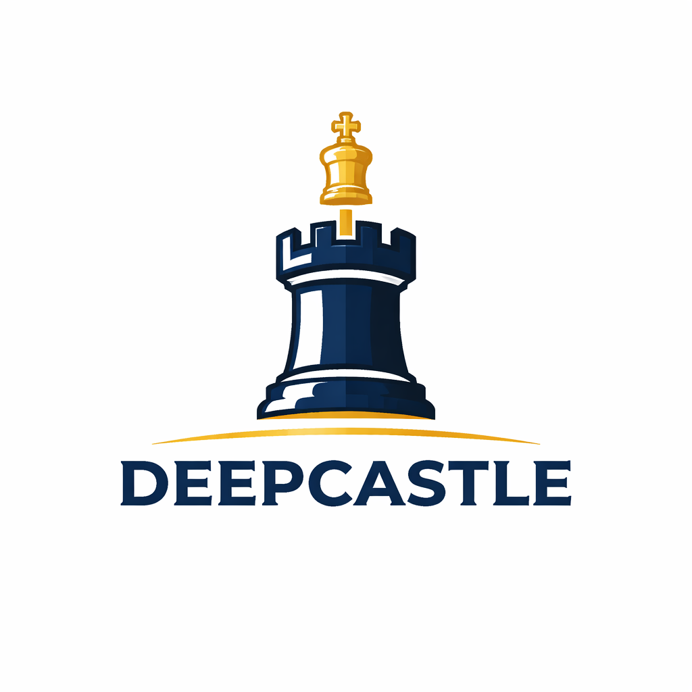

# DEEPCASTLE v7


> A custom NNUE chess engine and full-stack web app: train your own HalfKP network, run it in a Stockfish-derived search core, and play in the browser.

---

## What is DeepCastle?

**Deepcastle v7** pairs a **custom-trained NNUE** (`output.nnue`) with a **Stockfish-derived** alpha-beta search (GPLv3). Positional scores come from **your** exported weights, not Stockfish’s default nets.

**Play:** [deepcastle.vercel.app](https://deep-castle-official.vercel.app/) (frontend) talks to the engine API on Hugging Face Spaces.

**Reality checks (avoid hype):**

- **NPS** in the UI is often on the order of **~400k–600k nodes/s** on typical cloud CPUs at short think times—not millions. Throughput depends on hardware, time limit, and position.
- **Elo** is **not** a stable LTC title. One small match vs Stockfish 18 produced an SPRT *estimate* around strong-engine territory; treat it as **illustrative**, not a certified rating.
- The **backend** keeps **one** UCI engine process and **serializes** searches so the protocol stays safe under load (see `server/main.py`).

---

## Engine features (summary)

### Search
Stockfish-style tree search: PVS, iterative deepening, aspiration windows, LMR, null move, futility/delta pruning in qsearch, TT, killers/history, etc. (see `engine/src/search.cpp` and related).

### Evaluation (NNUE)
- Custom **HalfKP** net exported to `output.nnue`, loaded via UCI `EvalFile`.
- Architecture and training live under `training/` (PyTorch), aligned with the `nnue-pytorch` ecosystem.

### Performance
- **Transposition table** size via UCI `Hash` (the API defaults to a modest hash for small hosts—override with `ENGINE_HASH_MB` where you deploy).
- **Threads:** the hosted API often runs **`Threads` 1**; locally you can raise this for more throughput.

### UCI
Standard UCI commands; `EvalFile` / optional second net (`EvalFileSmall` if your build supports it) are set from the server or GUI.

**Syzygy tablebases** are supported by the engine **if** you build/run with paths configured—they are **not** required for the web demo.

---

## Architecture (3 tiers)

```
┌─────────────────────────────────────────┐
│  Browser (Vercel / Next.js)             │
│  react-chessboard, chess.js             │
└──────────────────┬──────────────────────┘
                   │  HTTPS POST /move, /analyze-game, …
                   ▼
┌─────────────────────────────────────────┐
│  Hugging Face Spaces (Docker)           │
│  FastAPI + python-chess UCI bridge      │
│  One long-lived `deepcastle` process    │
└──────────────────┬──────────────────────┘
                   │  stdin/stdout UCI
                   ▼
┌─────────────────────────────────────────┐
│  `deepcastle` ELF + `output.nnue`       │
│  (built from `engine/src/`)             │
└─────────────────────────────────────────┘
```

### Frontend (`web/`)
Next.js app: board, modes, review/analysis UI. Calls the public engine URL via `NEXT_PUBLIC_ENGINE_API_URL`.

### Backend (`server/main.py`)
FastAPI: starts or reuses a **single** engine subprocess, **locks** concurrent UCI I/O, optional **timeouts** and graceful **quit** on shutdown, `/health` and `/health/ready`.

### Engine (`engine/`)
C++ binary produced from the Stockfish codebase tree in `engine/src/`, plus your `.nnue` file(s). The repo `Dockerfile` builds from `engine/src` (or `/app/src` on minimal HF layouts) and installs the binary to `engine_bin/deepcastle`.

---

## Match note (vs Stockfish 18)

A short casual match was run for a **rough** strength signal:

| Metric | Result |
|--------|--------|
| Score | 0W – 1L – 21D (22 games) |
| Draw rate | high |

SPRT-derived **Elo difference** estimates are **uncertain** (wide error bars, short match). Do **not** cite a single number as “the” rating.

---

## Training pipeline (short)

| Stage | Notes |
|-------|--------|
| Data | e.g. `large_gensfen_multipvdiff_100_d9.binpack` (official NNUE dataset family) — **100M+** quiet positions, depth-9 style labels |
| Training | `training/deepcastle_v7.py` + `nnue-pytorch`-style tooling; **C++ binpack / SparseBatchDataset** path for fast loading |
| Export | `export_nnue.py` → quantized `.nnue` |
| Run | Point the engine at `output.nnue` via `EvalFile` |

Details: **[MECHANISM.md](MECHANISM.md)**.

---

## Repository layout

```
DeepCastle-Official/
├── engine/src/          # C++ engine (Stockfish-derived)
├── training/            # NNUE training, dataloaders, export
├── server/              # FastAPI API
├── web/                 # Next.js frontend
├── game/                # Local tools / pygame helpers
├── Dockerfile           # HF Spaces image (builds engine + serves API)
├── MECHANISM.md         # Long-form technical walkthrough
└── README.md            # This file
```

---

## Quick start (local)

**Engine (Windows example):** see `engine/build.bat` / `build_linux.sh`, then run the binary under a UCI GUI or stdin.

**API:**
```bash
cd server
pip install -r requirements.txt
uvicorn main:app --reload --host 0.0.0.0 --port 7860
```

Point the web app at `http://localhost:7860` via `NEXT_PUBLIC_ENGINE_API_URL`.

---

## Credits

- **Training stack:** [official-stockfish/nnue-pytorch](https://github.com/official-stockfish/nnue-pytorch) ecosystem.
- **Datasets:** [Stockfish NNUE training datasets](https://github.com/official-stockfish/nnue-pytorch/wiki/Training-datasets).
- **Search core:** [Stockfish](https://github.com/official-stockfish/Stockfish) (GPLv3).
- **Analysis:** [Chesskit](https://github.com/GuillaumeSD/Chesskit).
